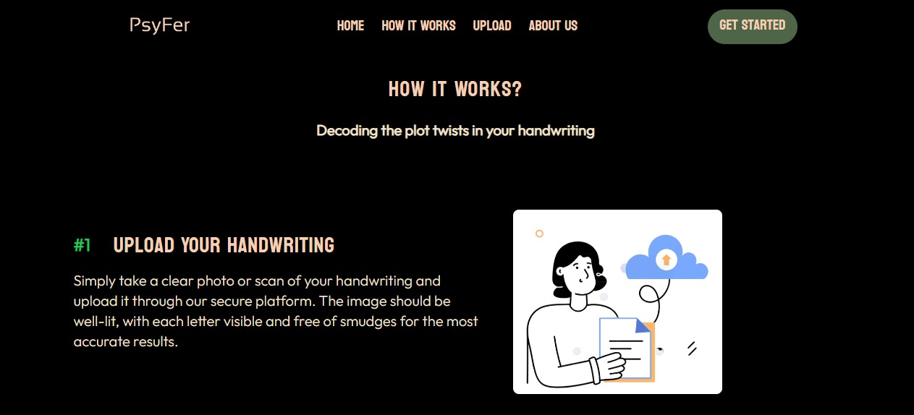

**This repository contains the website code for the college Graphology Website**
AI model can be found in repository: https://github.com/Pallavi2908/Graphology_AI  

# Motive behind project
## Introduction
Graphology is the study of handwriting to infer a person’s personality traits, behaviors, or psychological state. This project aims to analyze handwriting samples using modern technologies and algorithms to provide insightful results.
## Features
  - Handwriting Sample Input: Upload handwriting images or text samples.
  - Graphological Analysis: Extract handwriting features like slant, pressure, spacing, and size.
  - Personality Insights: Generate personality insights based on handwriting traits.
  - Export Reports: Behind the Scenes, our AI model works to interpret and generate a customized report .
    
# Website setup
  1. Clone this repo as well as the AI repo mentioned at the start of readme.md
     `git clone https://github.com/yourusername/graphology-project.git`
  2. Install dependencies
     ```bash
    npm install
    pip install -r requirements.txt
  3. Set up .env file for Mistral API key
  4. start development server
     ```bash
     npm run watch
  6. Start Flask server (make sure to open AI folder path in terminal to run API)
     ```bash
     python main.py 
# Screenshots
_The website was designed with a mobile-first approach_
  1. Mobile
     - 
     - 
     -    
  2. Desktop
     - 
     - 
     -        
